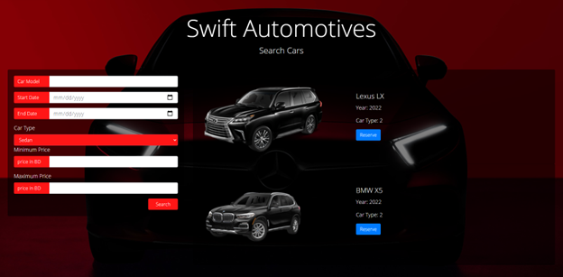
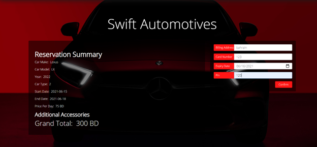
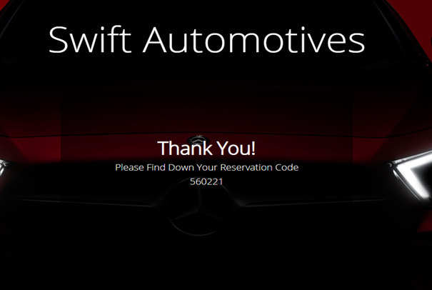
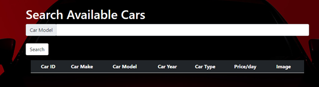
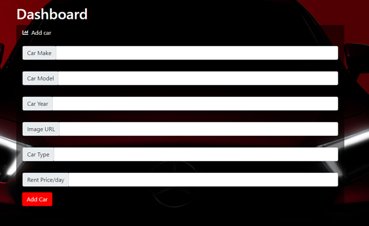

# Swift Automotives
 Website deomnstrating backend skills (README WORK IN PROGRESS)
 1.	Index Page:
Plays the roll of the main page of the website, where the user can reserve a car with searching criteria. The user must enter all fields except the car model field

Note: There are 3 car types : Sedan, SUV and Sport

Choose the car of your liking and press submit:
2.	Accessories Page:
Then you are redirected to choose the accessories you want to fit in the car, you can choose multiple accessories or none, then press the continue button.  

